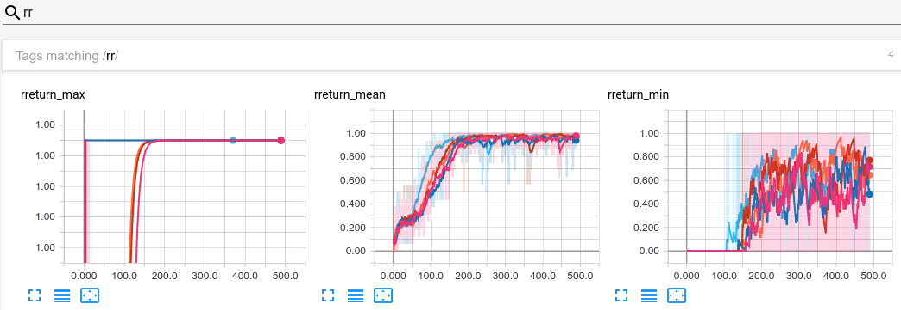

# RL Starter Files

RL starter files in order to immediatly train, visualize and evaluate an agent **without writing any line of code**.

These files are suited for [`gym-minigrid`](https://github.com/maximecb/gym-minigrid) environments 
and [`torch-ac`](https://github.com/lcswillems/torch-ac) RL algorithms. 
They are easy to adapt to other environments and RL algorithms.

## Features

- **Script to train**, including:
  - Log in txt, CSV and Tensorboard
  - Save model
  - Stop and restart training
  - Use A2C or PPO algorithms
- **Script to visualize**, including:
  - Act by sampling or argmax
  - Save as Gif
  - Log episode data in Tensorboard
- **Script to evaluate**, including:
  - Act by sampling or argmax
  - List the worst performed episodes
  - Log episodes in Tensorboard

## Local Installation 
NOTE: python > 3.7.7 is a problem
#### 1. Create a conda environment  
```
conda create -n minigrid python=3.7.7 
conda activate minigrid
```
    
#### 2. Clone this repository
```
git clone https://github.com/drucej/minigrid_torch.git
git checkout ccall_dev
```

#### 3. Install RL sandbox (includes local mini-grid)
This essentially ensures code dependencies are permanently 
available in the conda environment
```
cd <path-to>minigrid_torch
pip install -e .
```


## Docker Installation

#### 1. Clone this repository
```
git clone https://github.com/drucej/minigrid_torch.git
git checkout ccall_dev
```

#### 2. Create docker image (dockerfile at top level) 

The Docker image builds an Ubuntu-based OS that can run locally
using a CPU or on a GPU-enabled system.

Building the image from scratch takes on the order of 30 minutes.

```
Optional (docker system prune -a --volumes) or equivalent to clean up old containers, etc.

docker build -t rl_sandbox .
```


#### 3. Run Docker image (note jupyter is serving on port 8889)
```
docker run -p 6006:6006 -p 8889:8889 --rm -it --name rl_sandbox rl_sandbox:latest
```

This will return a prompt: `root@f553584171ae:/home/rl_sandbox# `  
showing you are running as root in the rl_sandbox home directory  
You can alternatively run as the rl_sandbox user:
```
su rl_sandbox
```
This will return a prompt: `$`  
Currently, the sandbox user's account isn't properly set up so tab completions, etc. are disabled.

#### 4. Stopping and Exiting Applications in Docker

Both Jupyter and Tensorboard servers (described below) are stopped with `^c`  (control c)   
In each case, you then need to exit the bash shell by typing: `exit`  
You also exit Docker with `exit`


## RL Sandbox: Example of use

**Note** for clarity of viewing results, we're using the convention of 
adding the grid size to the model name 

Train, visualize and evaluate an agent on the MiniGrid-DoorKey-5x5-v0 environment:


    1. Train the agent on the MiniGrid-DoorKey-5x5-v0 environment with PPO algorithm:

```
python -m scripts.train --algo ppo --env MiniGrid-DoorKey-5x5-v0 --model DoorKey5 --save-interval 10 --frames 1000000
```


    2. Visualize agent's behavior:

```
python -m scripts.visualize --env MiniGrid-DoorKey-5x5-v0 --model DoorKey5
```


    3. Evaluate agent's performance:

```
python -m scripts.evaluate --env MiniGrid-DoorKey-5x5-v0 --model DoorKey5
```


**Note:** More details on the commands are given below.

## Other examples

### Handle textual instructions

In the `GoToDoor` environment, the agent receives an image along with a textual instruction. 
To handle the latter, add `--text` to the command:

```
python -m scripts.train --algo ppo --env MiniGrid-GoToDoor-5x5-v0 --model GoToDoor5 --text --save-interval 10 --frames 1000000
```


### Add memory

In the `RedBlueDoors` environment, the agent has to open the red door then the blue one. 
To solve it efficiently, when it opens the red door, it has to remember it. 
To add memory to the agent, add `--recurrence X` to the command:

```
python -m scripts.train --algo ppo --env MiniGrid-RedBlueDoors-6x6-v0 --model RedBlueDoors6 --recurrence 4 --save-interval 10 --frames 1000000
```


For evaluating an agent with memory, add memory with the `--memory` argument
(otherwise the state dictionary is misaligned):

```
python -m scripts.evaluate --env MiniGrid-RedBlueDoors-6x6-v0 --model RedBlueDoors6 --memory
```


## Files

This package contains:
- scripts to:
  - train an agent \
  in `script/train.py` ([more details](#scripts-train))
  - visualize agent's behavior \
  in `script/visualize.py` ([more details](#scripts-visualize))
  - evaluate agent's performances \
  in `script/evaluate.py` ([more details](#scripts-evaluate))
- a default agent's model \
in `model.py` ([more details](#model))
- utilitarian classes and functions used by the scripts \
in `utils`

These files are suited for [`gym-minigrid`](https://github.com/maximecb/gym-minigrid) environments and [`torch-ac`](https://github.com/lcswillems/torch-ac) RL algorithms. They are easy to adapt to other environments and RL algorithms by modifying:
- `model.py`
- `utils/format.py`


<h2 id="scripts-train">scripts/train.py</h2>

An example of use:

```bash
python -m scripts.train --algo ppo --env MiniGrid-DoorKey-5x5-v0 --model DoorKey5 --save-interval 10 --frames 80000
```

The script loads the model in `storage/DoorKey5` or creates it if it doesn't exist, 
then trains it with the PPO algorithm on the MiniGrid DoorKey environment, 
and saves it every 10 updates in `storage/DoorKey5`. It stops after 80,000 frames.

**Note:** You can define a different storage location in the environment variable `PROJECT_STORAGE`.

More generally, the script has 3 required arguments:
- `--algo ALGO`: name of the RL algorithm used to train
- `--env ENV`: name of the environment to train on
- `--model MODEL`: name of the Model

and a bunch of optional arguments among which:
- `--recurrence N`: gradient will be backpropagated over N timesteps. By default, N = 1. If N > 1, a LSTM is added to the model to have memory.
- `--text`: a GRU is added to the model to handle text input.
- ... (see more using `--help`)

During training, logs are printed in your terminal (and saved in text and CSV format):


**Note:** `U` gives the update number, `F` the total number of frames, 
`FPS` the number of frames per second, `D` the total duration, `rR:μσmM` 
the mean, std, min and max reshaped return per episode, `F:μσmM` 
the mean, std, min and max number of frames per episode, `H` 
the entropy, `V` the value, `pL` the policy loss, `vL` the value loss and `∇` the gradient norm.

During training, evaluation and visualization, logs are also plotted in Tensorboard:




<h2 id="scripts-visualize">scripts/visualize.py</h2>

An example of use:

```
python -m scripts.visualize --env MiniGrid-DoorKey-5x5-v0 --model DoorKey5
```


In this use case, the script displays how the model in `storage/DoorKey5` 
behaves on the MiniGrid DoorKey environment.

More generally, the script has 3 required arguments:
- `--algo ALGO`: name of the RL algorithm used to train
- `--env ENV`: name of the environment to train on
- `--model MODEL`: name of the Model

and a bunch of optional arguments among which:
- `--argmax`: select the action with highest probability
- ... (see more using `--help`)

<h2 id="scripts-evaluate">scripts/evaluate.py</h2>

An example of use:

```
python -m scripts.evaluate --env MiniGrid-DoorKey-5x5-v0 --model DoorKey5
```


In this use case, the script prints in the terminal the performance among 
100 episodes of the model in `storage/DoorKey5`.

More generally, the script has 3 required arguments:
- `--algo ALGO`: name of the RL algorithm used to train
- `--env ENV`: name of the environment to train on
- `--model MODEL`: name of the Model

and a bunch of optional arguments among which:
- `--episodes N`: number of episodes of evaluation. By default, N = 100.
- ... (see more using `--help`)

<h2 id="model">model.py</h2>

The default model is described by the following schema:


By default, the memory part (in red) and the langage part (in blue) are disabled. 
They can be enabled by setting to `True` the `use_memory` and `use_text` 
parameters of the model constructor.

This model can be easily adapted to your needs.


<h2 id="tensorboard">Tensorboard</h2>

### Running Tensorboard

**Note** in order to see more than 10 images in a time series, 
add `--samples_per_plugin "images=250"` to the tensorboard command

#### Run Tensorboard

##### Locally
In a new terminal navigate to /<path-to>/rl_sandbox

```
tensorboard --logdir=storage --samples_per_plugin "images=250"
```

##### In Docker
In a new terminal  

```
docker exec -it rl_sandbox bash
tensorboard --logdir=storage --bind_all --samples_per_plugin "images=250"
```

In either case, you can now access Tensorboard via your browser 
   ```
   localhost:6006
   ```

### Tensorboard Event Files
RL Sandbox output is written to `/storage/<model_name>`  
Below this directory, Tensorboard event logs are stored separately by script type
  - `/storage/<model_name>/Evaluation`
  - `/storage/<model_name>/Train`
  - `/storage/<model_name>/Visualize`

Tensorboard directories are cleaned before each new run.

This file structure allows you to concentrate your attention to
a particular environment -- not only by turning on/off those layers you wish to see
in the Tensorboard dashboard, but by starting Tensorboard with a limited view:

```
tensorboard --logdir=storage/DoorKey5 --samples_per_plugin "images=250"
```

or even to a task type within that environment:

```
tensorboard --logdir=storage/DoorKey5/Train --samples_per_plugin "images=250"
```

###Example Tensorboard Output

#### Training
The script will also log to Tensorboard 


(the image shows the max, mean, min, and std for frame and return data).
There are currently separate graphs for FPS, entropy, grad_norm, policy_loss,
value, and value_loss

#### Evaluation
Current Evaluation Tensorboard logging consists of plotting the number of frames per episode
and the number of returns per episode.


#### Visualization
In addition to optionally writing out an animated gif showing all the agent's actions,
the user can set flags in the call to `visualize.py` to log agent actions every `<n>` episodes (default is 100).  This allows
the user to step through the agent's choices and actions per episode.


There's also an experimental time-series graph that plots the
number of steps the agent needed to complete the puzzle for each episode
(not very useful for the visualization case).


<h2 id="jupyter">Jupyter Notebook</h2>

#### Run Jupyter

##### Locally
In a new terminal navigate to /<path-to>/rl_sandbox

```
tensorboard --logdir=storage --samples_per_plugin "images=250"
```

##### In Docker
In a new terminal  
#####Run Jupyter as root
```
docker exec -it rl_sandbox bash
jupyter notebook --ip=0.0.0.0 --allow-root
```

#####Run Jupyter as rl_sandbox user
```
su rl_sandbox
docker exec -it rl_sandbox bash
jupyter notebook --ip=0.0.0.0 
```
 
you can now log in to Jupyter via your browser using the token '1234'
   ```
   localhost:8889/?token=1234
   ```

####. Set up data (needed by the example Jupyter Notebook)
In a new terminal, run
```
python -m scripts.train --algo ppo --env MiniGrid-DoorKey-6x6-v0 --model DoorKey6 --save-interval 10 --frames 80000
```


